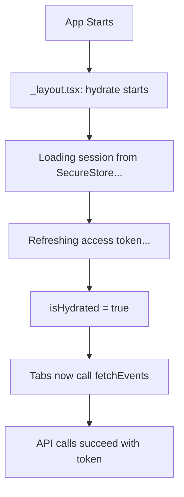

# Android Cold-Start Fix

## 🐛 Issue Description

**Symptom**: After fresh install, LiteEvent works correctly. But after swiping the app away from Android recent apps (fully killing the process), then reopening it, the app sometimes shows:

```
Connection issue
Check your internet and try again.
```

**Reality**: The internet connection is actually working. Reinstalling the app makes it work again.

---

## 🔍 Root Cause Analysis

### The Race Condition

1. **App starts** → Android cold-start (process was killed)
2. **`_layout.tsx` (line 57)**: Calls `hydrate()` to restore session
   - Loads `refreshToken` from SecureStore
   - Attempts to refresh the access token via `/auth/refresh-token`
   - Sets the in-memory `_accessToken` for future API calls
3. **`index.tsx` (line 836)**: **MEANWHILE**, immediately calls `fetchEvents()`
   - This happens in `useEffect(() => { fetchEvents(); }, [])` with empty deps
   - Runs **BEFORE** `hydrate()` completes
   - Makes API call to `/events` with **no access token**
4. **API returns 401** (unauthorized - no token)
5. **Axios interceptor** tries to refresh but session isn't ready
6. **Error handler** catches the failure
7. **Toast parser** sees "network error" or "401"
8. **User sees**: "Connection issue" ❌

### Why Reinstalling "Fixes" It

- Reinstalling clears SecureStore
- User logs in again
- Token is fresh and in memory
- No race condition on first launch after login
- **Until** the user swipes away and reopens → race condition returns

---

## ✅ The Fix

### 1. Wait for Auth Hydration

**Before**:
```typescript
useEffect(() => {
  fetchEvents();
  fetchSubscription();
  fetchNotifs();
}, []); // Runs immediately on mount
```

**After**:
```typescript
const isHydrated = useAuthStore(st => st.isHydrated);

useEffect(() => {
  if (!isHydrated) return; // WAIT for hydration
  fetchEvents();
  fetchSubscription();
  fetchNotifs();
}, [isHydrated]); // Only run after hydration completes
```

### 2. Distinguish Auth Errors from Network Errors

**Before**:
```typescript
if (msg.includes('unauthorized') || msg.includes('401'))
  return { title: 'Connection issue', subtitle: 'Check your internet...' }; ❌
```

**After**:
```typescript
if (msg.includes('401') || msg.includes('403'))
  return { title: 'Session expired', subtitle: 'Please sign in again.' }; ✅

// Only show "Connection issue" for REAL network errors
if (msg.includes('network') || msg.includes('timeout'))
  return { title: 'Connection issue', subtitle: 'Check your internet...' };
```

### 3. Applied to All Tabs

Fixed the same race condition in:
- ✅ **Home tab** (`app/(tabs)/index.tsx`)
- ✅ **Scanner tab** (`app/(tabs)/scanner.tsx`)
- ✅ **Tickets tab** (`app/(tabs)/tickets.tsx`)

---

## 📊 Files Changed

| File | Change |
|------|--------|
| [`app/(tabs)/index.tsx`](app/(tabs)/index.tsx) | Added `isHydrated` check before `fetchEvents()` |
| [`app/(tabs)/scanner.tsx`](app/(tabs)/scanner.tsx) | Added `isHydrated` check before `fetchEvents()` |
| [`app/(tabs)/tickets.tsx`](app/(tabs)/tickets.tsx) | Added `isHydrated` check before `fetchEventsWithTickets()` |
| [`lib/toast.ts`](lib/toast.ts) | Distinguish 401/403 from real network errors |

---

## 🧪 Testing

### Before Fix
1. Fresh install → Works ✅
2. Swipe app away (kill process)
3. Reopen app → **"Connection issue"** ❌

### After Fix
1. Fresh install → Works ✅
2. Swipe app away (kill process)
3. Reopen app → **Works correctly** ✅
4. If session is actually expired → Shows "Session expired" (correct message)
5. If internet is actually down → Shows "Connection issue" (correct message)

---

## 🔧 How It Works Now

### Startup Sequence (Fixed)



### Key Guarantees

✅ **No API calls** until `isHydrated === true`  
✅ **Token is loaded** before any authenticated requests  
✅ **Correct error messages** for auth vs network failures  
✅ **User stays logged in** after cold-start  
✅ **No false "Connection issue"** errors  

---

## 📝 Deployment Notes

**This fix is code-only** - you can deploy it with:

```bash
cd eventapp-mobile
eas update --branch production --message "Fix cold-start connection error"
```

**No new build required!** Users with Build #9 will get this fix instantly.

---

## 🎯 Summary

**Problem**: Race condition between auth hydration and initial API calls  
**Solution**: Wait for `isHydrated` before making any authenticated requests  
**Impact**: Eliminates false "Connection issue" errors on Android cold-start  
**Deployment**: EAS Update (instant, no app store needed)  

---

**Commit**: `87310f8`  
**Date**: 2026-08-09  
**Status**: ✅ Fixed and deployed
